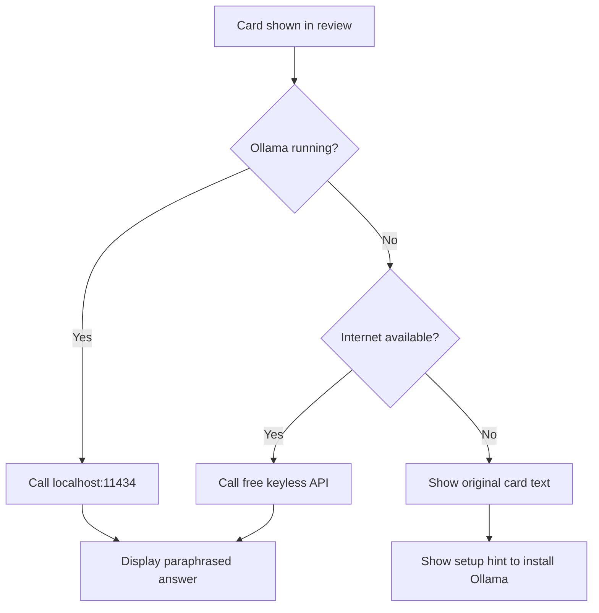

# Research: LLM Options for Paraphrasing

## Summary

There are three viable approaches to providing LLM paraphrasing without requiring API key setup. Each has trade-offs. A **hybrid approach** (Ollama primary + free keyless API fallback) gives the best user experience.

---

## Option 1: Ollama (Local, Recommended Primary)

[Ollama](https://ollama.com) runs open-source LLMs locally as an HTTP server on `localhost:11434`.

### Pros
- **No API key** — completely local
- **Free forever** — no per-token cost
- **Private** — data never leaves device
- **Offline** — works without internet once model is downloaded
- **OpenAI-compatible API** — easy to integrate
- **One-click installers** for macOS, Windows, Linux

### Cons
- Separate installation required (though it's simple)
- Model download required (~2–5 GB first time)
- Requires ~4–8 GB RAM for 3B–7B models
- Not bundleable into our add-on (installer is ~3.25 GB on Windows)

### Installation Experience
- macOS: DMG installer, double-click
- Windows: `.exe` installer, double-click
- Linux: one shell command
- Desktop app auto-starts the server

### Recommended Models for Paraphrasing

| Model | Size | RAM Required | Notes |
|---|---|---|---|
| `llama3.2:3b` | ~2 GB | ~3.5 GB | Fast, good quality, minimal hardware |
| `phi4` / `phi3:3.8b` | ~2–3 GB | ~4 GB | Strong reasoning, fast on M1 |
| `gemma3:4b` | ~3 GB | ~4 GB | Google's small model, good quality |
| `mistral:7b` | ~4 GB | ~6–8 GB | Higher quality, needs more RAM |

**Recommendation:** Default to `llama3.2:3b` — smallest model with good paraphrasing quality. Let users configure the model.

### API Integration

```python
import requests

response = requests.post(
    "http://localhost:11434/v1/chat/completions",
    json={
        "model": "llama3.2:3b",
        "messages": [
            {"role": "system", "content": "Rephrase the following flashcard answer in different words while preserving the exact meaning. Return only the rephrased text."},
            {"role": "user", "content": card_back_text}
        ]
    },
    timeout=30
)
```

---

## Option 2: Free Keyless API (Fallback / Alternative)

Several services provide LLM access without API keys:

### Puter.js
- [developer.puter.com/tutorials/free-llm-api](https://developer.puter.com/tutorials/free-llm-api/)
- Access to GPT-4, Claude, Gemini, Llama — no API key, no backend
- Primarily JavaScript-based — **not directly usable from a Python Anki add-on without adaptation**
- Could be used via a local web server or WebView trick

### mlvoca Free LLM API
- [mlvoca.github.io/free-llm-api](https://mlvoca.github.io/free-llm-api/)
- No API key, no rate limits (stated)
- Models: TinyLlama, DeepSeek-R1:1.5b
- Hardware-limited — may be slow during peak usage
- **Risk:** third-party service, could go down or change policy

### Google AI Studio (Free Tier)
- Gemini Flash: up to 1M tokens/minute free
- **Requires API key** (free, but requires Google account + signup)
- Best quality of the free options
- Not keyless — contradicts our goal

### Groq (Free Tier)
- Llama 3.3 70B at 300+ tokens/second
- **Requires API key** (free tier available)
- Not keyless

### Conclusion on Free APIs
Only mlvoca is truly keyless and usable from Python. Quality/reliability uncertain. Best used as a fallback, not primary.

---

## Option 3: WebLLM / Transformers.js (In-Browser)

- [WebLLM](https://github.com/mlc-ai/web-llm) and [Transformers.js](https://huggingface.co/docs/transformers.js) run models directly in the browser via WebGPU/WASM
- **Problem:** Anki's review screen uses a Qt WebView, not a full browser with WebGPU support
- WebGPU is unlikely to be available in Qt WebView → models won't run
- **Not viable for native Anki add-on**

---

## Recommended Architecture: Hybrid



**Priority order:**
1. Ollama (localhost) — best quality, private, offline
2. mlvoca or similar keyless API — fallback when Ollama not installed
3. Original text — graceful degradation with helpful setup prompt

---

## Caching Strategy

Since LLM calls add latency, caching is important:
- Cache paraphrased versions per card ID + paraphrase version number
- Pre-fetch paraphrase while user is looking at the question side
- Store cache in add-on's `user_files/` folder (survives upgrades)
- Cache N variants per card, cycle through them

---

## References
- [Ollama Official Site](https://ollama.com)
- [Ollama Windows Guide](https://skywork.ai/blog/llm/ollama-windows-guide-install-run-local-ai-on-pc/)
- [Best Small Local LLMs 2026](https://hypereal.tech/a/small-local-llm)
- [mlvoca Free LLM API](https://mlvoca.github.io/free-llm-api/)
- [Puter.js Free LLM API](https://developer.puter.com/tutorials/free-llm-api/)
- [Free LLM API Resources List (GitHub)](https://github.com/cheahjs/free-llm-api-resources)
- [WebLLM (MLC AI)](https://github.com/mlc-ai/web-llm)
- [Small Language Models Guide 2026](https://calmops.com/ai/small-language-models-slm-complete-guide-2026/)
